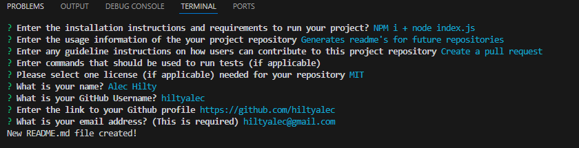

# ReadMeMaker

Challenge 9: README Generator

This application is a command line application that generates a README.md file from a user's input using hte Inquierer package.

The application can be invoked using the command "node index.js"

Repo: https://github.com/hiltyalec/ReadMeMaker